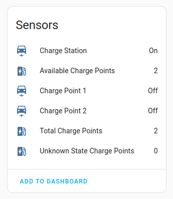
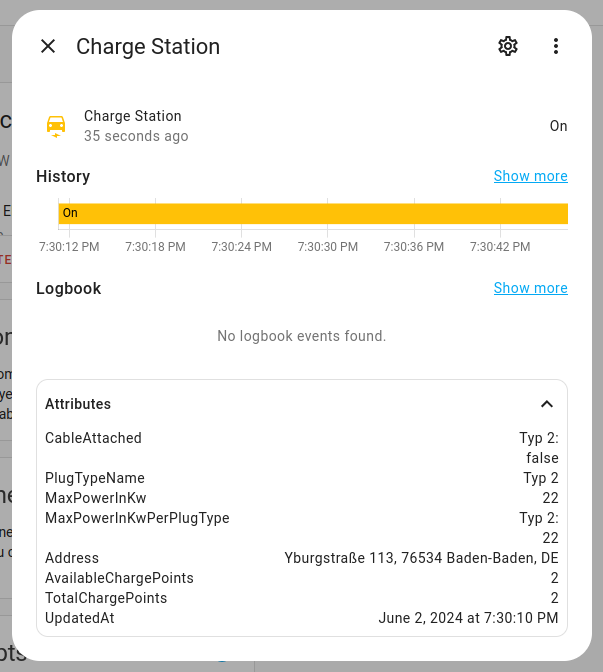
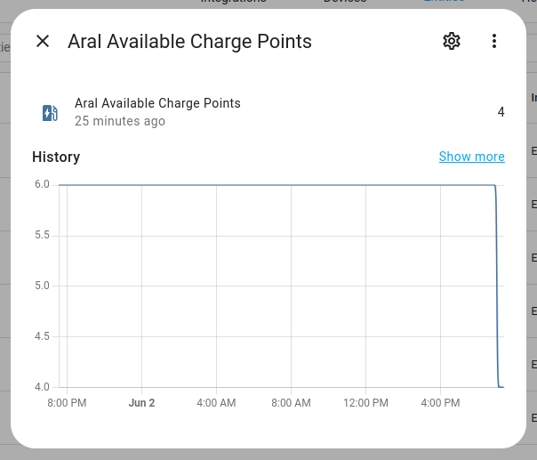

# EnBw Charge Stations Custom Component for Home Assistant
This custom component integrates the status of EnBw charge stations into Home Assistant, allowing users to search for hot charge stations in their area and track their status.

## Notice of Non-Affiliation and Disclaimer

We are not affiliated, associated, authorized, endorsed by, or in any way officially connected with EnBW Energie Baden-Württemberg, or any of its subsidiaries or its affiliates. The official EnBW Energie Baden-Württemberg website can be found at [https://www.enbw.com/](https://www.enbw.com/). The map to find nearby charge stations can be found [here](https://www.enbw.com/elektromobilitaet/produkte/mobilityplus-app/ladestation-finden/map)

## Description

The EnBw charge stations component for Home Assistant makes it possible to act based on the status of nearby ev charge stations. This can be used in automations, assistants, scripts,or anything else.

## Features

- Status of the charge point, including detailed information using attributes 
- Sensor counter to display the number of total, free and unknown state charge points.
- Easy integration using search feature


## Setup

1. Ensure you have [HACS installed ](https://hacs.xyz/docs/setup/download/)
2. Add the repo as a custom repository
3. Install the integration
4. Restart HomeAssistant
5. Acquire a API Key and Station Number if preferred (This can be done using the developer tools of your browser)
    
    * Open the [map](https://www.enbw.com/elektromobilitaet/produkte/mobilityplus-app/ladestation-finden/map) to find nearby charge stations.
    * Open the development tools and network monitor of your browser
        * Firefox Network Monitor — [Firefox Source Docs documentation](https://firefox-source-docs.mozilla.org/devtools-user/network_monitor/)
        * Chrome Network features reference - [Chrome Developers](https://developer.chrome.com/docs/devtools/network/reference/)
    * Search for a charge station and open the detail pane
    * Search in the network requests for a request to the api, looking like this:
      ```
      https://enbw-emp.azure-api.net/emobility-public-api/api/v1/chargestations/{STATION_NUMBER}
      ```
      You can also use the station number at the end of the request for the setup.
    * Open the request and search for the API Key in the headers. It is a hexadecimal value and will look like this:
      ```
      Ocp-Apim-Subscription-Key: {API_KEY}
      ```
3. Add the Integration from the HomeAssistant UI
4. Provide the API-Key
5. Optional: Provide a Station Number (may be needed if your desired station is not shown in the search list)
6. If station number was not provided, select one from the list.
7. Enjoy

## Screenshots





